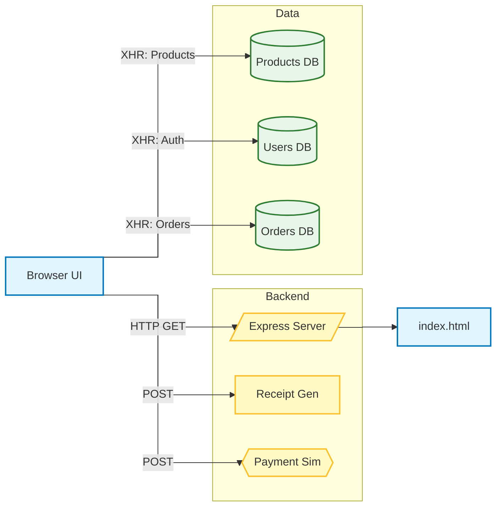
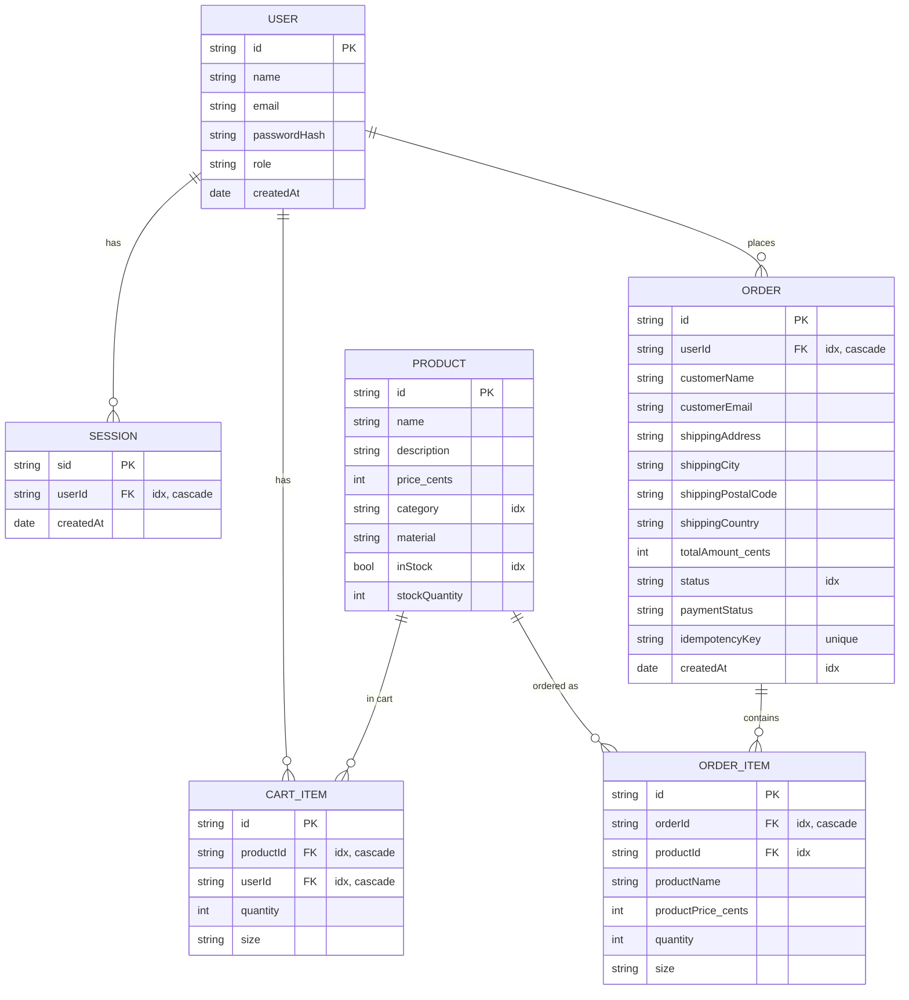
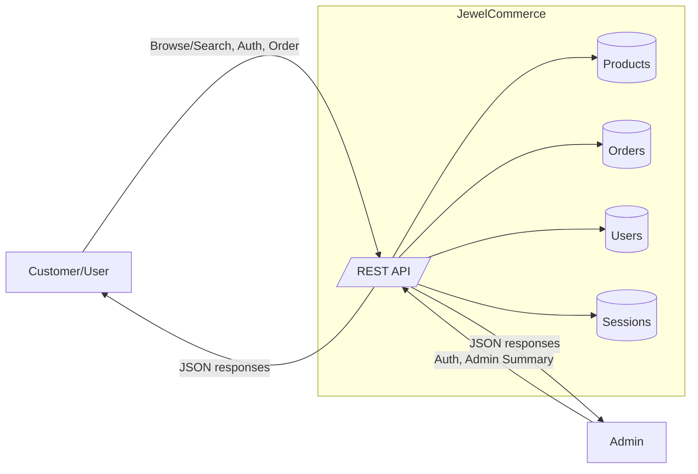
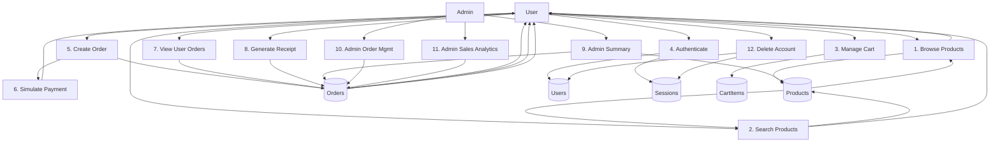
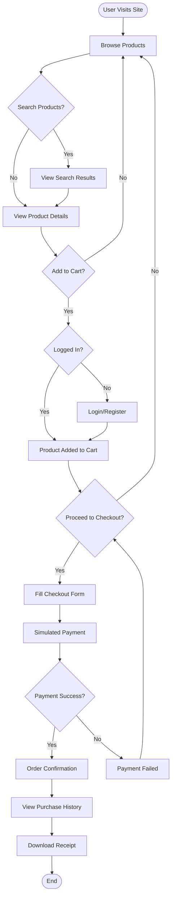
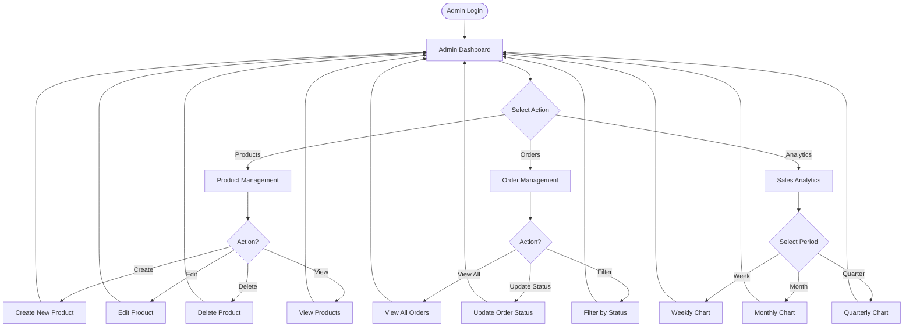

# Architecture Documentation

## System Overview

JewelCommerce is a full-stack e-commerce platform built with a monorepo structure. The application uses React for the frontend, Express for the backend, and supports both in-memory and PostgreSQL data persistence.

## Architecture Diagram



## Data Model & ERD

### Entity Relationship Diagram



### Database Schema Details

#### Users Table
- **Primary Key**: `id` (UUID)
- **Unique Constraint**: `email` (prevents duplicate registrations)
- **Fields**: name, email, passwordHash, role (user|admin), createdAt
- **Indexes**: email (unique)

#### Products Table
- **Primary Key**: `id` (UUID)
- **Fields**: name, description, price (in cents), category, imageUrl, images[], material, isPreOrder, inStock, stockQuantity, sizes[]
- **Indexes**: category, inStock
- **Notes**: Price stored in IDR cents (1 IDR = 100 cents)

#### Orders Table
- **Primary Key**: `id` (UUID)
- **Foreign Keys**: userId → users.id (cascade delete)
- **Unique Constraint**: `idempotencyKey` (prevents duplicate orders)
- **Fields**: Customer details, shipping info, totalAmount (cents), status, paymentStatus, createdAt
- **Indexes**: userId, createdAt, status
- **Status Flow**: pending → processing → completed | cancelled

#### OrderItems Table
- **Primary Key**: `id` (UUID)
- **Foreign Keys**: 
  - orderId → orders.id (cascade delete)
  - productId → products.id
- **Fields**: productName, productPrice (cents), quantity, size
- **Indexes**: orderId, productId
- **Notes**: Product name and price are snapshotted at time of order

#### CartItems Table
- **Primary Key**: `id` (UUID)
- **Foreign Keys**:
  - productId → products.id (cascade delete)
  - userId → users.id (cascade delete)
- **Fields**: quantity, size
- **Indexes**: userId, productId

#### Sessions Table
- **Primary Key**: `sid` (session ID)
- **Foreign Keys**: userId → users.id (cascade delete)
- **Fields**: createdAt
- **Indexes**: userId
- **Notes**: Table exists for audit trail; JWT tokens used for authentication

## Data Flow Diagrams

### Context Diagram (Level 0)



### Level 1 DFD (Process Decomposition)



### Process Descriptions

1. **Browse Products** - GET /api/products, /api/products/:id
2. **Search Products** - GET /api/search?q=...
3. **Manage Cart** - Client-side only (localStorage + database-backed)
4. **Authenticate User** - /api/auth/* endpoints
5. **Create Order** - POST /api/orders (requires auth)
6. **Simulate Payment** - POST /api/payment/simulate
7. **View User Orders** - GET /api/user/orders (requires auth)
8. **Generate Receipt** - POST /api/receipt/generate (requires auth)
9. **Admin Summary** - GET /api/admin/summary (admin only)
10. **Admin Order Management** - GET /api/orders, PATCH /api/orders/:id/status (admin only)
11. **Admin Sales Analytics** - GET /api/admin/sales (admin only)
12. **Delete Account** - POST /api/account/delete (requires auth)

## Application Flow

### User Journey Flow



### Admin Flow



## Frontend Architecture

### Component Structure

```
client/src/
├── pages/                    # Route components
│   ├── home.tsx             # Landing page
│   ├── products.tsx         # Product listing
│   ├── product-detail.tsx   # Single product
│   ├── checkout.tsx         # Checkout flow
│   ├── order-success.tsx    # Order confirmation
│   ├── login.tsx            # Login page
│   ├── register.tsx         # Registration
│   ├── user-dashboard.tsx   # User account
│   ├── purchase-history.tsx # Order history
│   ├── admin-dashboard.tsx  # Admin overview
│   ├── admin-orders.tsx     # Order management
│   └── admin-product-form.tsx # Product CRUD
│
├── components/
│   ├── header.tsx           # Navigation
│   ├── cart-sheet.tsx       # Shopping cart
│   ├── product-card.tsx     # Product display
│   ├── theme-toggle.tsx     # Dark mode switch
│   ├── modals/              # Modal dialogs
│   └── ui/                  # Radix UI components
│
└── lib/
    ├── auth-context.tsx     # Auth state
    ├── cart-context.tsx     # Cart state
    ├── theme-context.tsx    # Theme state
    ├── queryClient.ts       # React Query config
    └── utils.ts             # Helper functions
```

### State Management

- **Authentication**: Context API with JWT tokens (HTTP-only cookies)
- **Cart**: Context API + localStorage + database persistence
- **Server State**: React Query for data fetching and caching
- **Theme**: Context API for dark/light mode
- **Forms**: Zod validation with React Hook Form

### Routing

Using Wouter for client-side routing:
- `/` - Home page
- `/products` - Product listing (supports ?category=...)
- `/product/:id` - Product detail
- `/checkout` - Checkout (auth required)
- `/order-success` - Order confirmation
- `/login`, `/register` - Authentication
- `/dashboard` - User dashboard (auth required)
- `/purchase-history` - Order history (auth required)
- `/admin` - Admin dashboard (admin only)
- `/admin/orders` - Order management (admin only)
- `/admin/products/new` - Create product (admin only)
- `/admin/products/:id/edit` - Edit product (admin only)

## Backend Architecture

### Server Structure

```
server/
├── index.ts          # Server bootstrap & middleware setup
├── routes.ts         # REST API endpoints
├── storage.ts        # Data layer abstraction
├── db.ts            # PostgreSQL connection & pool
├── jwt.ts           # JWT token utilities
├── middleware.ts    # Auth & rate limiting middleware
├── seed.ts          # Database seeding script
└── vite.ts          # Vite dev server integration
```

### Middleware Stack

1. **Request Logging** - Logs all incoming requests
2. **CORS** - Cross-origin resource sharing
3. **JSON Parser** - Parses JSON request bodies
4. **URL Encoded Parser** - Parses form data
5. **Cookie Parser** - Parses cookies from requests
6. **Rate Limiting** - IP-based rate limits
7. **Authentication** - JWT token verification
8. **Vite Dev Server** - Development mode only

### Data Layer

The storage layer provides a unified interface that automatically switches between in-memory and PostgreSQL storage based on the `DATABASE_URL` environment variable.

**Interface:**
```typescript
interface Storage {
  // Users
  getUser(id: string): Promise<User | null>
  getUserByEmail(email: string): Promise<User | null>
  createUser(data: InsertUser): Promise<User>
  deleteUser(id: string): Promise<void>
  
  // Products
  getProducts(): Promise<Product[]>
  getProduct(id: string): Promise<Product | null>
  createProduct(data: InsertProduct): Promise<Product>
  updateProduct(id: string, data: Partial<Product>): Promise<Product>
  deleteProduct(id: string): Promise<void>
  searchProducts(query: string): Promise<Product[]>
  
  // Orders
  getOrders(): Promise<Order[]>
  getOrder(id: string): Promise<Order | null>
  getUserOrders(userId: string): Promise<Order[]>
  createOrder(data: InsertOrder, items: InsertOrderItem[]): Promise<Order>
  updateOrderStatus(id: string, status: string): Promise<Order>
  
  // Cart
  getCartItems(userId: string): Promise<CartItem[]>
  addCartItem(data: InsertCartItem): Promise<CartItem>
  updateCartItem(id: string, quantity: number): Promise<CartItem>
  deleteCartItem(id: string): Promise<void>
  clearCart(userId: string): Promise<void>
}
```

### Authentication & Security

- **JWT Tokens**: Stored in HTTP-only cookies
- **Password Hashing**: bcrypt with salt rounds
- **Session Expiry**: Expires on browser close
- **Rate Limiting**: 
  - Registration: 5 attempts per 15 minutes per IP
  - Login: 10 attempts per 15 minutes per IP
  - Account deletion: 5 attempts per 15 minutes per IP

### Concurrency Handling

1. **Database Transactions**: All write operations use transactions
2. **Connection Pooling**: Max 20 concurrent connections
3. **Idempotency Keys**: Prevent duplicate orders
4. **Atomic Operations**: Inventory decrements use SQL transactions
5. **Unique Constraints**: Email uniqueness at database level

## Deployment Architecture

### Production Setup

```
[Load Balancer]
      |
      v
[Application Server(s)]
      |
      +-- [PostgreSQL Database]
      +-- [Redis Cache] (optional)
      +-- [Static Assets]
```

### Environment Variables

**Required:**
- `JWT_SECRET` - Secret for JWT token signing

**Optional:**
- `DATABASE_URL` - PostgreSQL connection string
- `REDIS_URL` - Redis connection string
- `PORT` - Server port (default: 5173)
- `NODE_ENV` - Environment (production|development)

### Performance Metrics

- **Capacity**: 500-1000 concurrent users
- **Throughput**: 100-200 requests/second
- **Response Time**: <100ms (average)
- **Database Pool**: 20 connections max
- **Rate Limits**: Varies by endpoint

## Monitoring & Observability

### Key Metrics to Monitor

1. **Application Metrics**
   - Request rate
   - Response time
   - Error rate
   - Active users

2. **Database Metrics**
   - Connection pool usage
   - Query performance
   - Transaction rate
   - Lock contention

3. **Business Metrics**
   - Orders per hour
   - Conversion rate
   - Cart abandonment
   - Revenue tracking

### Health Check Endpoint

Add to `server/routes.ts` for monitoring:

```typescript
app.get("/api/health", (req, res) => {
  res.json({ 
    status: "ok",
    timestamp: new Date().toISOString(),
    uptime: process.uptime()
  });
});

app.get("/api/health/db", async (req, res) => {
  const stats = await getPoolStats();
  res.json(stats);
});
```

## Security Considerations

### Best Practices Implemented

1. ✅ Password hashing with bcrypt
2. ✅ HTTP-only cookies for JWT tokens
3. ✅ Rate limiting on sensitive endpoints
4. ✅ SQL injection prevention (parameterized queries)
5. ✅ XSS prevention (React escaping)
6. ✅ CSRF protection (SameSite cookies)
7. ✅ Input validation with Zod
8. ✅ Unique constraints on critical fields
9. ✅ Transaction isolation for concurrent writes
10. ✅ Secure account deletion with confirmation

### Recommendations for Production

- Enable HTTPS/TLS
- Set secure `JWT_SECRET` (32+ random characters)
- Configure proper CORS origins
- Enable request logging
- Set up error tracking (e.g., Sentry)
- Regular security audits
- Database backups
- Implement request signing for sensitive operations

## Technology Stack Details

### Frontend Dependencies

- **react** (18.x) - UI library
- **wouter** (3.x) - Lightweight router
- **@tanstack/react-query** (5.x) - Server state management
- **tailwindcss** (3.x) - Utility-first CSS
- **@radix-ui/react-\*** - Accessible component primitives
- **zod** (3.x) - Schema validation
- **recharts** (2.x) - Charts for analytics

### Backend Dependencies

- **express** (4.x) - Web framework
- **drizzle-orm** (0.x) - TypeScript ORM
- **pg** (8.x) - PostgreSQL client
- **bcryptjs** (2.x) - Password hashing
- **jsonwebtoken** (9.x) - JWT tokens
- **zod** (3.x) - Schema validation

### Development Tools

- **vite** (5.x) - Build tool
- **typescript** (5.x) - Type safety
- **tsx** (4.x) - TypeScript execution
- **drizzle-kit** (0.x) - Database migrations
- **esbuild** (0.x) - Fast bundler
